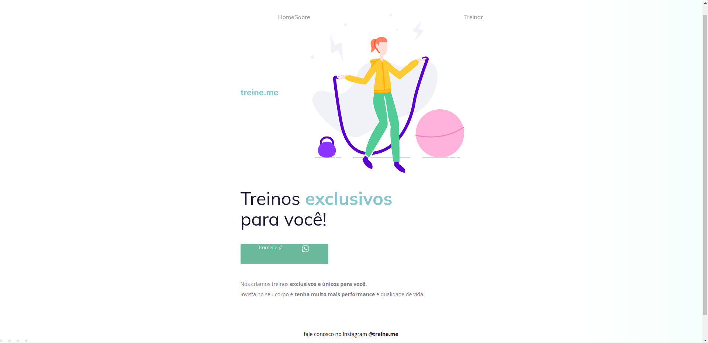
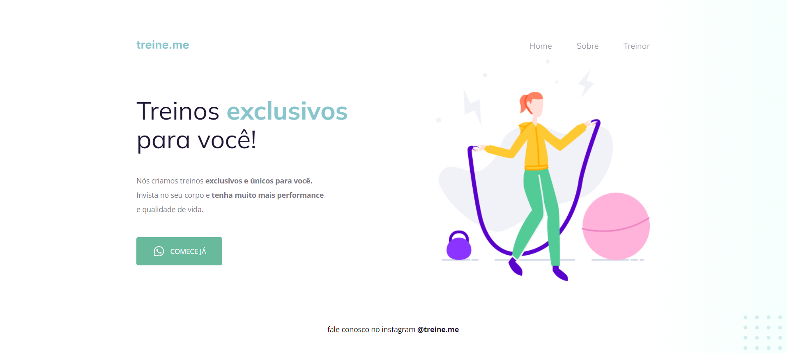

# 💻 Sobre o desafio

Nesse desafio, você receberá um código com o projeto desenvolvido durante as aulas da Fase 02.
E, novamente, a surpresa ~~(não tão surpresa assim)~~ vem aí... **👀**
O código sofreu algumas alterações nos principais pontos abordados nessa fase e, como podemos ver na imagem abaixo, ele não está mais da mesma forma que o Maykão deixou.

# 🎨 Layout do desafio

  

# 🎨 Layout do desafio finalizado

  

